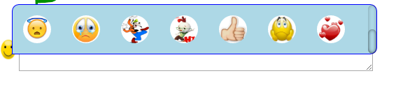

[<< Back](README.md)
### <p style="color: #191970;"> Emoji Menu</p> 

<p  style="color: #2874A6;">There is a tradition to use menu to select an emoji to send as message. Like in <b>Facebook, Twitter, WatsApp and  Hangout</b> and so on. <b>`ng2-emojify`</b> has a built-in support for the same.</p>

##### <p style="color: #2874A6;"> 1. Add `Emotion` service in component's `.ts` file</p>
```js
import {CustomEmotion, Emotion} from 'ng2-emojify';

...

constructor(private customEmotion: CustomEmotion, private emotion: Emotion) {

    /* ************************************************************************
     *  @ Emotion
     * `emojiId` - This is the simple string like `:happy:` or `:smile:` of the
        emoji that has been clicked in the emoji menu.
     * ************************************************************************/
     
     this.emotion.CaptureEmojiClick().subscribe((emojiId: string) => {
      console.log('Emoji Id: ', emojiId);
      // write your logic here
    });
}
...
```

<p style="color:#191970;">Write your logic in `CaptureEmojiClick()` to use this `emojiId` in message string.</p>

##### <p style="color: #2874A6;"> 2. Add `[emotion-menu]` directive and `<emoji-menu></emoji-menu>` component in component's `.template` file.</p>
```html
 <div [innerHTML]="message | emojify"></div>
 <button [emotion-menu] id="btn">Menu</button>
 <emoji-menu></emoji-menu>
```
Here, when `button` is clicked, `Emoji Menu` gets displayed as shown a above picture. when an emoji is clicked,  its `emojiId` can be listen in `CaptureEmojiClick()`. When you click outside `Emoji Menu`, it gets closed.

###### <p style="color: #191970;"> `IMPORTANT:` Please give a unique id to the HTML element on which you have added the `[emotion-menu]` directive </p>

##### <p style="color: #2874A6;"> 3. Add emoji-menu css</p>

Add custom css in component's `.ts` file.

```js
import {CustomEmotion, Emotion} from 'ng2-emojify';

...

customEmotionCss: any = {
        customEmotionMenuCss: {
            position: 'fixed',
            'border-radius': '10px 10px 10px 0px',
            width: 520 + 'px',
            height: 200 + 'px',
            'background-color': 'lightblue',
            border: '1px solid blue',
            'z-index': 1,
            'overflow-x': 'hidden'
        },

        customEmotionContainerCss: {
            float: 'left',
            width: 80 + 'px',
            height: 80 + 'px',
            margin: '15px'
        },
        
        customEmotionImageCss: {
            width: '100%',
            height: '100%',
            margin: '0px',
           'border-radius': '50%'
        }
   };

constructor(private customEmotion: CustomEmotion, private emotion: Emotion) {

    /* **********************************************************************
     *  @ Emotion
     * `emojiId` - This is the simple string like :happy: or :smile: of the
        emoji that has been clicked in the emoji menu.
     * **********************************************************************/
     
     this.emotion.CaptureEmojiClick().subscribe((emojiId: string) => {
      console.log('Emoji Id: ', emojiId);
      // write your logic here
    });
}
...
```

##### <p style="color: #2874A6;"> 4. Now, assign css to the `[emotion-menu]` directive in `template` file.</p>

```html
 <div [innerHTML]="message | emojify"></div>
 <button [emotion-menu] ="customEmotionCss" id="btn">Menu</button>
 <emoji-menu></emoji-menu>
```

 <p style="color:#191970;"> Now, run your application server and click `button` to see `Emoji Menu`.</p>
[<< Back](README.md)