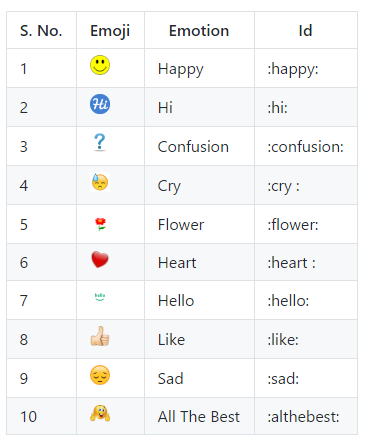

## An angular 2 module to support built-in and custom emoji.

You can see [Live Demo application](https://ng2-emojify-example.firebaseapp.com), or [run on local system](https://github.com/sauravgaursmith/ng2-emojify-example/blob/master/README.md)

<!--  -->
##### Sample message 

I'm so happy 😊 today after getting 1000 likes 👍. Thanks you friends. ❤

##### [Emoji List](#)

[<b>Note</b> This is the list built-in supported emojis. But custom emoji(s) can be added.]()



<!-- | S. No. | Emoji                                        | Emotion     | Id          |
|--------|----------------------------------------------|-------------|-------------|
| 1      |        | Happy       | :happy:     |
| 2      |           | Hi          | :hi:        |
| 3      |    | Confusion   | :confusion: |
| 4      |          | Cry         | :cry :      |
| 5      |       | Flower      | :flower:    |
| 6      |        | Heart       | :heart :    |
| 7      |        | Hello       | :hello:     |
| 8      |         | Like        | :like:      |
| 9      |          | Sad         | :sad:       |
| 10     |    | All The Best| :althebest: | -->

##### [Prerequisite](#) 
       * Angular-cli: 1.0.0-beta.18 or higher
       * NPM : 4.0.2 or higher
       * Node: v6.9.1 or higher

##### [Installation](#)
```sh
npm install ng2-emojify  --save
        or
yarn add ng2-emojify --save
```

##### [How to use ?](#)

##### 1. Put `emoji` folder into the `assets` folder
Goto the `node_modules/ng2-emojify/emoji` and Copy the `emoji` and paste in `assets`.

##### 2. Add `Ng2EmojifyModule` in the module file.

```js
import {Ng2EmojifyModule} from 'ng2-emojify';

@NgModule({
 ...
  imports: [
    Ng2EmojifyModule
  ],
 ...
})
export class AppModule {
}

```

##### 3. Add emoji style in `.css` or `.scss` file.
```css
<!-- This is just for example. It can be customized as per need.  -->
<!-- Just use class name ".emoji-image". -->

:host >>> .emogi-image {
  height: 60px;
  width: 60px;
  border-radius: 50%;
}

```


##### 4. Add `emojify` pipe to `message` in your component `template`. Like it ...

```html
 <div [innerHTML]="message | emojify"></div>
```
 
 Here, `message` is message string like - `I'm so happy today. :happy:`. In this string `:happy:`
 is an emoji identity. It will be converted to an image tag after passing through `emojify` pipe.


 
##### [To use custom emoji](#)

###### Add `CustomEmotion` service to your component `.ts` file. 

```js
import {CustomEmotion} from 'ng2-emojify';

...

constructor(private customEmotion: CustomEmotion) {
    /* Mandatory to keep in constructor */
    
    /* ***************************************************************************
     *  @ CustomEmotion
     * `emojiId` - This is the id which will be used to convert into emoji.
     * `emojiUrl` - This is the path to that image/gif which is to be used as emoji.
     * `title` - This is the `title` to be shown as `tooltip`.
     * *************************************************************************** */
     
    this.customEmotion.AddCustomEmotions([
      {
        emojiId: 'myemojiId',
        emojiUrl: 'assets/emoji/my-emoji.jpg',
        title: 'My Emoji'
      },

      {
        emojiId: 'myheart',
        emojiUrl: 'https://github.com/sauravgaursmith/ng2-emojify/blob/master/emoji/heart.jpg',
        title: 'My Heart'
      }
    ]);
}
...
```
Here, `emojiUrl` is path to the image which is to be used as emoji. An emoji file may be `.jpg`, `.png` and`.gif` file. `assets/emoji/` is `default` path used by this module. However, this path may be any valid path.

[<b>IMPORTANT</b>: Please note, <b>built-in emojiId</b> can be override.]()

### Congrats
This is all about this module.

###### Report issues [here](https://github.com/sauravgaursmith/ng2-emojify/issues)
###### Feel free to sent your comments, queries and suggestions at [js.tech.feedback@gmail.com](mailto:js.tech.feedback@gmail.com)

### License

[MIT](LICENSE)
